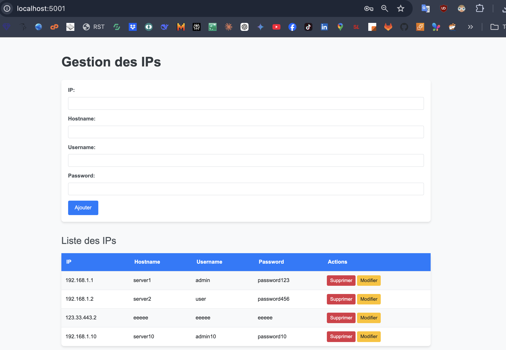
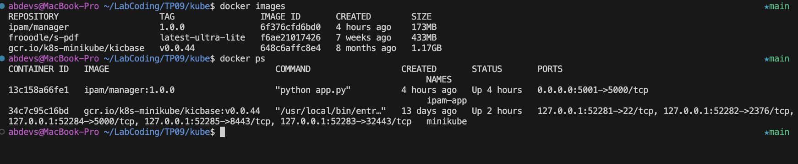
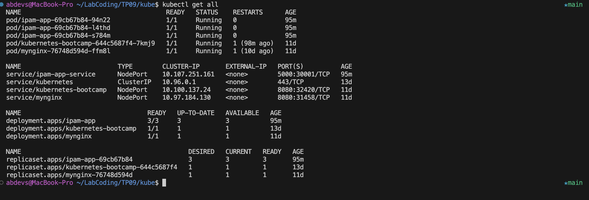

## IPAM Manager
- J'ai développé une application Python basée sur Flask qui expose une API REST pour effectuer des opérations CRUD sur un fichier JSON. Ce fichier JSON contient des données structurées autour des champs suivants : ip, hostname, username et password.

- Pour améliorer l'expérience utilisateur, j'ai ajouté une interface graphique développée en HTML, CSS et JavaScript. Cette interface permet de visualiser et de manipuler les données de manière intuitive.

- J'ai également créé un module Ansible pour interagir avec cette API. Ce module utilise les variables suivantes : api_url, ip, hostname, username et password. J'ai testé ce module avec un playbook Ansible en local, et il fonctionne correctement.

- Pour faciliter le déploiement et la gestion de l'application, j'ai créé un Dockerfile et un fichier docker-compose.yml afin de containeriser l'application. Cela permet une installation et une exécution simplifiées dans un environnement Docker.

- j'ai configuré l'application pour être déployée sur Kubernetes. J'ai créé deux fichiers de configuration : deployment.yaml et service.yaml. En utilisant Minikube pour mon cluster Kubernetes local, j'ai appliqué ces fichiers pour orchestrer l'application dans Kubernetes.
- L'application est  déployée et fonctionne correctement dans cet environnement.

